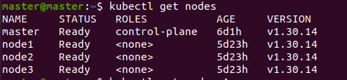
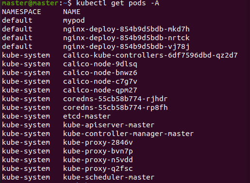
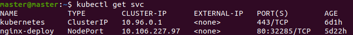
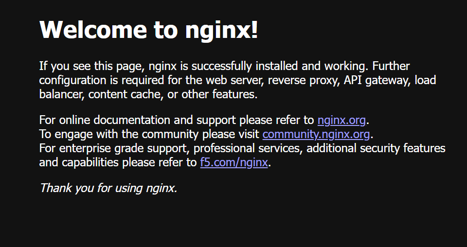

# Kubernetes Cluster Setup and Nginx Deployment

## Project Overview

This project demonstrates the setup of a Kubernetes cluster consisting of:

- 1 Master Node
- 3 Worker Nodes

After creating the cluster, an Nginx application was deployed using Kubernetes Deployment and Service resources.

## Environment

- Operating System: Ubuntu Linux
- Virtualization Platform: VMware Workstation
- Kubernetes
- kubeadm
- kubelet
- kubectl
- Docker / Container Runtime

## Cluster Architecture

```
Master Node
│
├── Worker Node 1
├── Worker Node 2
└── Worker Node 3
```

## Objectives

- Create a multi-node Kubernetes cluster.
- Join worker nodes to the master node.
- Deploy containerized applications.
- Expose applications using Kubernetes Services.
- Manage pods and deployments using kubectl.

## Installation Steps

### Initialize Kubernetes Master Node

```bash
sudo kubeadm init
```

### Configure kubectl

```bash
mkdir -p $HOME/.kube
sudo cp -i /etc/kubernetes/admin.conf $HOME/.kube/config
sudo chown $(id -u):$(id -g) $HOME/.kube/config
```

### Join Worker Nodes

```bash
kubeadm join <MASTER-IP>:6443 --token <TOKEN> \
--discovery-token-ca-cert-hash sha256:<HASH>
```

### Verify Cluster

```bash
kubectl get nodes
```

## Nginx Deployment

### Create Deployment

```bash
kubectl apply -f deployment.yaml
```

### Verify Pods

```bash
kubectl get pods
```

### Create Service

```bash
kubectl apply -f service.yaml
```

### Verify Services

```bash
kubectl get services
```

## Project Files

```
kubernetes-cluster-project/
│
├── deployment.yaml
├── service.yaml
├── README.md
├── commands/
│   └── commands.txt
│
└── screenshots/
    ├── cluster-ready.png
    ├── nodes-output.png
    ├── get-pods.png
    ├── get-services.png
    └── nginx-working.png
```

## Screenshots

### Cluster Ready



### Nodes Output


### Pods Running



### Services Running



### Nginx Application



## Commands Used

```bash
kubectl get nodes
kubectl get pods
kubectl get services
kubectl apply -f deployment.yaml
kubectl apply -f service.yaml
```

## Project Highlights

- Built a Kubernetes cluster with 1 Master Node and 3 Worker Nodes.
- Configured cluster communication using kubeadm.
- Deployed Nginx application using Kubernetes Deployment.
- Exposed application using Kubernetes Service.
- Managed cluster resources using kubectl commands.
- Verified pod and service status through Kubernetes CLI.

## Skills Demonstrated

- Linux Administration
- Kubernetes Administration
- Cluster Setup
- Pod Management
- Deployments
- Services
- YAML Configuration
- Container Orchestration
- Troubleshooting

## Learning Outcomes

- Understanding Kubernetes Architecture
- Managing Master and Worker Nodes
- Deploying Applications on Kubernetes
- Exposing Applications via Services
- Monitoring Cluster Resources

## Author

ASHA 
